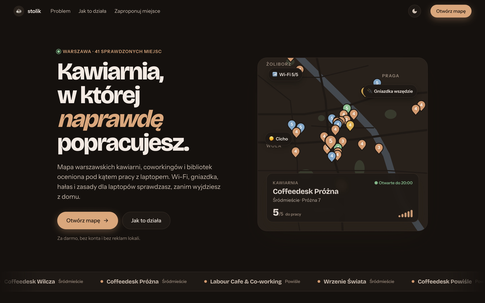
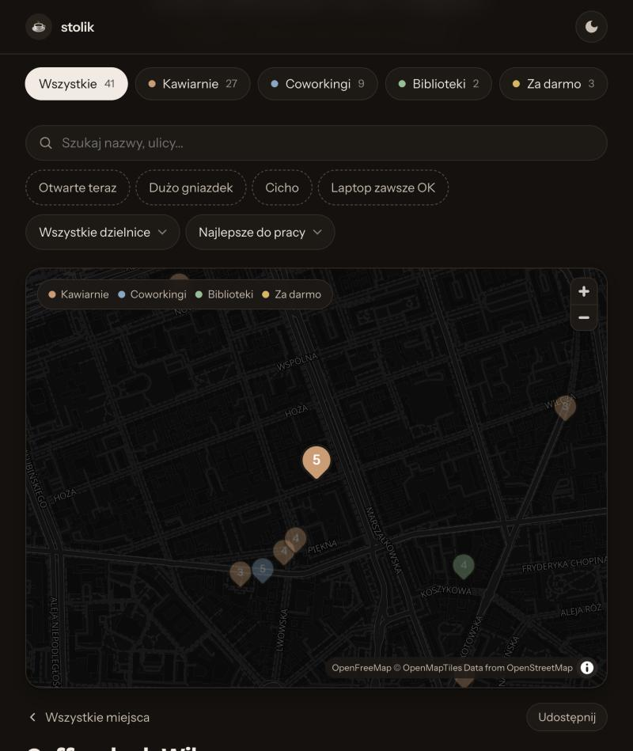

<div align="center">

# ☕ stolik

**Mapa warszawskich kawiarni, coworkingów i bibliotek oceniona pod kątem pracy z laptopem.**
Wi-Fi, gniazdka, hałas i zasady dla laptopów sprawdzasz, zanim wyjdziesz z domu.

[](https://github.com/Ilniczak/stolik/stargazers)
[](LICENSE)




</div>

## Po co to jest

Mapy powiedzą Ci, że kawa jest dobra. Nie powiedzą, gdzie jest gniazdko, czy Wi-Fi uciągnie calla
i czy w weekend w ogóle wpuszczą Cię z laptopem. **stolik** zbiera te informacje w jednym miejscu.

- 🗺️ **Mapa z oceną „do pracy” 1–5** widoczną od razu na pinezce
- 📶 **Wi-Fi, gniazdka, hałas, zasady dla laptopów** dla każdego miejsca
- 🕗 **„Otwarte teraz”** na podstawie godzin z OpenStreetMap, w czasie warszawskim
- 🔎 Filtry, wyszukiwarka, dzielnice i sortowanie „najbliżej mnie”
- ➕ **Formularz propozycji nowych miejsc** zapisujący zgłoszenia w Postgresie (Neon)
- 🌓 Jasny i ciemny motyw, działa na telefonie

<div align="center">

</div>

## ⭐ Podoba Ci się?

Zostaw gwiazdkę, to najprostszy sposób, żeby pomóc projektowi dotrzeć do innych osób pracujących zdalnie.
Znasz dobre miejsce do pracy? Zaproponuj je przez formularz na stronie albo otwórz pull request.

## Uruchomienie lokalnie

```bash
npm install
npm run dev
```

Strona działa pod http://localhost:8765. Bez `DATABASE_URL` propozycje z formularza zapisują się do `.dev/propozycje.json`.
Z plikiem `.env` (wzór w `.env.example`) trafiają do Neon, tak jak na produkcji.

## Jak to jest zbudowane

Celowo prosto: bez frameworka i bez kroku build.

| Plik | Co robi |
| --- | --- |
| `index.html`, `landing.*` | Landing z animacjami |
| `mapa.html`, `app.js`, `styles.css` | Mapa (MapLibre GL + kafelki OpenFreeMap) |
| `zaproponuj.html`, `zaproponuj.js`, `form.css` | Formularz propozycji |
| `places.js` | Wszystkie miejsca na mapie |
| `hours.js` | Parser godzin otwarcia w formacie OSM |
| `api/propozycje.js` | Funkcja Vercel `POST /api/propozycje` → Neon |
| `db/schema.sql` | Tabela `propozycje` |

## Dodawanie miejsca (pull request)

Dopisz obiekt do `places.js`. Opis pól jest na górze pliku. Współrzędne najłatwiej wziąć z
[OpenStreetMap](https://www.openstreetmap.org), a godziny wpisać w formacie `Mo-Fr 08:00-20:00; Sa-Su 09:00-18:00`.
Ocena „do pracy” jest redakcyjna, więc w opisie PR napisz, skąd znasz to miejsce.

Po zmianach w CSS lub JS podbij `?v=…` w plikach HTML, żeby przeglądarki pobrały nowe wersje.

## Wdrożenie: Vercel + Neon

1. Zaimportuj repozytorium w Vercelu (Framework: Other, bez komendy build).
2. W projekcie: Storage → Create → Neon. Integracja doda zmienną `DATABASE_URL`.
3. W konsoli SQL Neon uruchom `db/schema.sql`.

Nowe zgłoszenia:

```sql
select * from propozycje where status = 'nowa' order by created_at desc;
```

Po dodaniu miejsca do `places.js` oznacz zgłoszenie: `update propozycje set status = 'dodana' where id = …;`

## Dane i licencja

Kod jest na licencji [MIT](LICENSE). Adresy, współrzędne i godziny otwarcia pochodzą z
[OpenStreetMap](https://www.openstreetmap.org/copyright) (© współtwórcy OpenStreetMap, ODbL).
Kafelki mapy: [OpenFreeMap](https://openfreemap.org).
